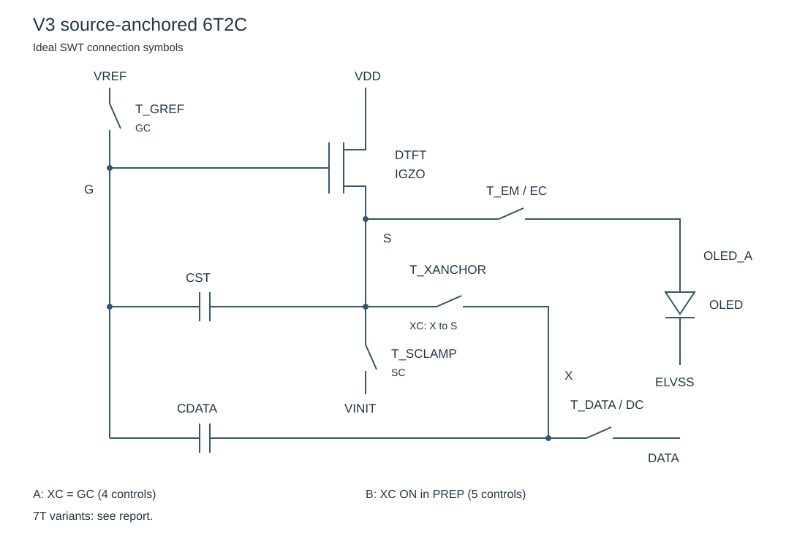
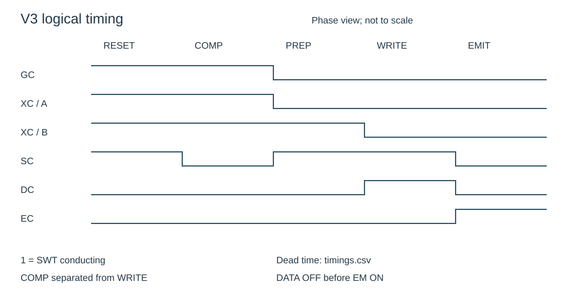
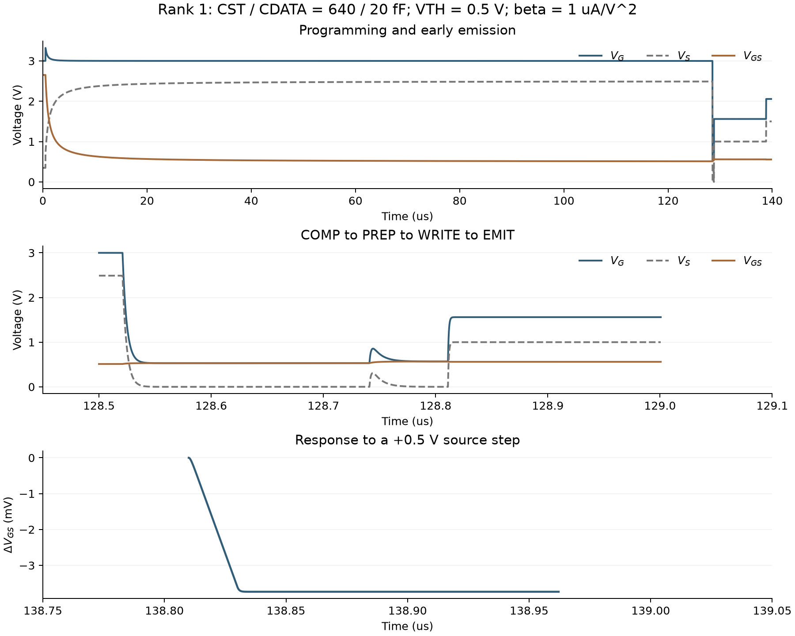

# V3：按用户四条约束重跑的AMOLED IGZO像素电路审计

生成入口：`python3 screen_v3.py`、`python3 validate_v3_spice.py`、`python3 build_v3_figures.py`、`python3 build_v3_report.py`。

## 结论与V2更正

V2的功能通过结论撤回。其X节点在补偿阶段连接VREF，源极重定位后又由DATA强制驱动，会衰减已采样的阈值量。即使无寄生且充分建立，跨阶段推导也得到 `∂(VGS−VTH)/∂VTH = −κ`。以160/80 fF为例，κ=1/3，阈值残差系数为−1/3；旧代码只检查局部压缩和源极自举，未检查这一必要条件。旧2,088个通过点是旧代理布尔门的结果，不能作为补偿有效性证据。

V3在有限源极跟随骨架内枚举3,024个电容连接、DATA端口、X锚点和控制阶段组合，5个实现通过理想机制检查。有效核心为 `CST: G–S`、`CDATA: G–X`，补偿期间 `X连接S`。其充分建立、无寄生结果为 `VGS=VTH+κ(VDATA−VINIT)`，`κ=CDATA/(CST+CDATA)`。

5个实现对应一个核心电容连接和不同开关配置/时序，不是5个全新独立电容拓扑。参数层180个点、24组时长，两个6T实现交叉32种SWT工艺角色分配，完成55,296组降阶动态评估；源极稳定性优先的10个差异化电容点完成90次ngspice行为瞬态复核。

**没有已证明的全局综合最优Top 10。** 未给总电容/面积、行时间和κ目标时，增大CST、延长补偿仍可改善部分指标。本报告交付有限范围内的稳定性优先候选及实测于行为仿真器的代价；PDK运行次数为0。

## 用户约束原文与操作定义

> 请帮我构建一个DTFT为IGZO TFT的AMOLED像素电路。像素电路设计的限制条件为:1电容最多为2个，GOA控制信号最多为5组，STFT不限制使用LTPS或IGZO 2.DATA电压的变化值写入到DTFT的Vgs有一个压缩比。3 需要实现阈值电压补偿和Data写入分离的方式 4.DTFT的Vgs需要在Data写入之后保持相对稳定，保证DTFT 源极变化时Vgs稳定性最好

压缩解释为 `0<|∂VGS/∂VDATA|<1`，要求WRITE期间成立且发光时保留；阈值补偿的理想必要条件是 `∂(VGS−VTH)/∂VTH=0`。计算容差1e−7仅用于判断数值恒等式，不是7位精度的器件规格。寄生和有限时长下保留误差实数，不使用5%或98%拒绝候选。

| V2自加限制 | V3处理 | 依据 |
|---|---|---|
| κ限于0.20–0.60，评分目标1/3 | 只要求0<\|κ\|<1；无特定目标 | 用户要求压缩，未指定压缩强度 |
| \|ΔVGS/ΔVS\|≤5% | 报告连续指标，按稳定性优先排序 | 用户要求相对稳定和最好，未给5%门槛 |
| CST+CDATA≤240 fF | 撤销总值门槛；仅保留最多2只 | 电容数量约束不等于面积或电容总值约束 |
| 60 Hz保持≤5%、EM压降≤100 mV | 保留示例测量，无产品通过门 | 刷新率、容差和电流规格未给出 |
| 补偿98%、写入99%建立率 | 计算有限时间残差，不做该门限拒绝 | 没有用户授权的建立精度要求 |
| 固定GS存储结构和6/7T结论 | 1/2C、6条候选电容边、3个DATA端、3种X锚点 | 结构是待检验变量；本轮仍声明有限骨架 |
| 按自定权重计算综合分数 | 源极稳定性优先；多指标并列；并列时用较少C/T/控制组 | 不把代理偏好包装成综合最优 |

## 有限搜索域：明确覆盖与遗漏

内部连续节点为G/S/X，R为静态参考。6条电容候选边为GS、GX、GR、SX、SR、XR；单电容6种、双电容15种，共21种。并联重复电容在理想模型中等效为单电容，未另算。X锚点取R/S/G，PREP是否保持锚定2种，DATA端取G/S/X，EMIT是否重新锚定2种，源极复位/保持开关合并或拆分2种，DTFT漏极隔离开关有/无2种：`21×3×2×3×2×2×2=3,024`。

本轮只对上述声明域完整枚举，未覆盖额外模拟节点、多DTFT、双栅IGZO、电流镜、电流编程、任意新增SWT、任意阶段重排、不同OLED连接、所有W/L及连续电平/时长。这些属于未搜索区域，不属于用户禁止的电路。GOA≤5组指输入控制波形预算，本轮没有合成GOA移位寄存器。

每个理想机制在100/30、100/100、100/230 fF三种比例上审计，避免把偶然电容比下的零误差当成普遍补偿。通过结构再遍历每只电容20/40/80/160/320/640 fF，共36个值对，得到180个参数点。

## 逐层筛选：淘汰原因可逐行追溯

| 阶段 | 剩余 | 本层淘汰 |
|---|---|---|
| 生成结构/阶段组合 | 3024 | 0 |
| GOA≤5组 | 1701 | 1323 |
| 无DATA与VINIT短路 | 1134 | 567 |
| 发光保留内在压缩增益 | 118 | 1016 |
| WRITE期间已经压缩 | 38 | 80 |
| 跨阶段保留阈值补偿 | 5 | 33 |

完整排除证据见[structure_audit.csv](structure_audit.csv)。每行保留结构ID、边、锚点、DATA端、控制组数和第一失败原因。单电容在此域没有通过，不能外推为所有IGZO单电容方案都不可能。

## 通过的候选结构与实际连接

| ID | 电容连接 | PREP锚定 | 拆分SC | 漏极隔离 | GOA组数 | T数 |
|---|---|---|---|---|---|---|
| S3-fd65244088 | G-S;G-X | False | False | False | 4 | 6 |
| S3-7f211789e6 | G-S;G-X | False | False | True | 4 | 7 |
| S3-08c937a01c | G-S;G-X | False | True | False | 5 | 7 |
| S3-03b6d9e577 | G-S;G-X | True | False | False | 5 | 6 |
| S3-7b5c2814dc | G-S;G-X | True | False | True | 5 | 7 |



图中SWT画为受控开关，以避免把理想开关当成已经完成W/L设计的晶体管。DTFT漏极接VDD，源极S经EM连接OLED阳极；GREF为G–VREF；XANCHOR为X–S；SCLAMP为S–VINIT；DATA为X–VDATA。与V2的关键差别是XANCHOR另一端从VREF改到S。

A型：XANCHOR与GREF同波形，4组；B型：XANCHOR保持到PREP结束，5组。拆分SRESET/SHOLD的7T方案仅在A型满足5组。漏极隔离7T方案用p-LTPS开关，其导通状态为SCLAMP的反相，理想情况下共享一条物理控制线；实际高低电平须用器件阈值检查，若需要额外电平转换或额外GOA线，应重计预算。7T方案只完成机制审计，未获得6T仿真指标的自动背书。

## 时序与阈值量的跨阶段保存



1. RESET：G=VREF，S=VINIT，X经XANCHOR接S；OLED断开。
2. COMP：释放S，G仍固定，X接S；DTFT源跟随使S趋近VREF−VTH，两只电容都采样VTH。
3. PREP：先断GREF再钳位S到VINIT；A型X浮置，B型X仍接S。理想电容条件下G随S移动，VGS保留VTH。
4. WRITE：断XANCHOR，由DATA驱动X；S保持钳位，形成压缩写入。
5. EMIT：断DATA、释放SCLAMP，随后开EM；G/X浮置，CST使G随S自举。

时序表的1表示器件导通，不等同于所有材料/极性的高栅压。插入的非重叠间隙是仿真波形构造，不是新增用户硬门。GC必须先于S重新钳位关闭，DATA必须先于EM开启关闭；否则会覆盖阈值或短接外部电源。

## 电荷守恒、阈值残差与寄生模型

逐阶段求解 `C(v_new−v_old)=Aᵀq, A·v_new=b`。A编码固定电位和短接，q为外部注入电荷；未连接电源的独立导体及短接组总电荷守恒。节点状态同时携带常数、VTH、DATA三个系数，因此可直接跟踪阈值量是否在WRITE中丢失。详见[charge_history.csv](charge_history.csv)。

标称寄生场景：G对地3 fF、X对地2 fF、S负载20 fF。对正确核心，写入增益为 `κ=CDATA/(CST+CDATA+CG)`，源极敏感度为 `s=(CG+CDATA·CX/(CDATA+CX))/(CST+CG+CDATA·CX/(CDATA+CX))`。阈值残差为 `−CG/(CST+CDATA+CG)`；理想CG=CX=0时两项都为0。这些寄生数值是计算场景，未从版图提取。

## 有限域内稳定性优先Top 10：原理图与timing对应

主排序指标为源极敏感度绝对值，数值10位小数内并列时依次比较阈值残差、电容总值、T数、控制组数和ID。去除电容值及传输完全相同的实现，保留10个电容点；其余实现仍在全量CSV中。每个点的参考时序按编程误差、保持漂移、EM压降、地址时间依次选取，不代表用户指定的综合目标。

| 序 | 参数ID | 结构ID | CST/CDATA fF | κ | 源极敏感度% | 阈值残差系数% | 时序 | GOA |
|---|---|---|---|---|---|---|---|---|
| 1 | P3-196fd81247 | S3-fd65244088 | 640/20 | 0.030 | 0.747 | 0.452 | T3-19 | 4 |
| 2 | P3-09ab49edb4 | S3-fd65244088 | 640/40 | 0.059 | 0.761 | 0.439 | T3-19 | 4 |
| 3 | P3-9d6921b59c | S3-fd65244088 | 640/80 | 0.111 | 0.768 | 0.415 | T3-19 | 4 |
| 4 | P3-3d8eed56d6 | S3-fd65244088 | 640/160 | 0.199 | 0.771 | 0.374 | T3-19 | 4 |
| 5 | P3-0424d5b3c3 | S3-fd65244088 | 640/320 | 0.332 | 0.773 | 0.312 | T3-21 | 4 |
| 6 | P3-7ecd5f7d99 | S3-fd65244088 | 640/640 | 0.499 | 0.774 | 0.234 | T3-21 | 4 |
| 7 | P3-84fe3862bf | S3-fd65244088 | 320/20 | 0.058 | 1.483 | 0.875 | T3-19 | 4 |
| 8 | P3-24654949ad | S3-fd65244088 | 320/40 | 0.110 | 1.510 | 0.826 | T3-19 | 4 |
| 9 | P3-306acce247 | S3-fd65244088 | 320/80 | 0.199 | 1.524 | 0.744 | T3-19 | 4 |
| 10 | P3-685a0471fd | S3-fd65244088 | 320/160 | 0.331 | 1.531 | 0.621 | T3-13 | 4 |

每行可通过结构ID找到同名JSON连接表，通过timing ID查下表，并通过[spice_validation.csv](spice_validation.csv)定位9个实际运行的`.cir`网表。参考工艺分配是GREF/XANCHOR/DATA/SCLAMP为IGZO、EM为LTPS，属于复用未校准Ron/Roff场景下的选择。

## 全部24组时长候选及代表点结果

RESET=0.5 µs、PREP=0.2 µs；COMP为2/8/32/128 µs；WRITE为0.05/0.2/1 µs；三段非重叠时间均为0.02或0.1 µs。所有组合均记录，未用98%建立率淘汰。下表固定稳定性第一候选和参考SWT工艺；完整工艺×时长评估见[dynamic_candidates.csv](dynamic_candidates.csv)。

| 时序 | COMP µs | WRITE µs | 总寻址µs | 补偿剩余过驱mV | 编程误差mV | 保持变化mV |
|---|---|---|---|---|---|---|
| T3-01 | 2.000 | 0.050 | 2.810 | 508.576 | 507.852 | -1.529 |
| T3-02 | 2.000 | 0.050 | 3.050 | 508.576 | 507.852 | -1.529 |
| T3-03 | 2.000 | 0.200 | 2.960 | 508.576 | 507.852 | -1.529 |
| T3-04 | 2.000 | 0.200 | 3.200 | 508.576 | 507.852 | -1.529 |
| T3-05 | 2.000 | 1.000 | 3.760 | 508.576 | 507.852 | -1.529 |
| T3-06 | 2.000 | 1.000 | 4.000 | 508.576 | 507.852 | -1.529 |
| T3-07 | 8.000 | 0.050 | 8.810 | 157.107 | 157.973 | -1.348 |
| T3-08 | 8.000 | 0.050 | 9.050 | 157.107 | 157.973 | -1.348 |
| T3-09 | 8.000 | 0.200 | 8.960 | 157.107 | 157.973 | -1.348 |
| T3-10 | 8.000 | 0.200 | 9.200 | 157.107 | 157.973 | -1.348 |
| T3-11 | 8.000 | 1.000 | 9.760 | 157.107 | 157.973 | -1.348 |
| T3-12 | 8.000 | 1.000 | 10.000 | 157.107 | 157.973 | -1.348 |
| T3-13 | 32.000 | 0.050 | 32.810 | 41.736 | 43.124 | -1.289 |
| T3-14 | 32.000 | 0.050 | 33.050 | 41.736 | 43.124 | -1.289 |
| T3-15 | 32.000 | 0.200 | 32.960 | 41.736 | 43.124 | -1.289 |
| T3-16 | 32.000 | 0.200 | 33.200 | 41.736 | 43.124 | -1.289 |
| T3-17 | 32.000 | 1.000 | 33.760 | 41.736 | 43.124 | -1.289 |
| T3-18 | 32.000 | 1.000 | 34.000 | 41.736 | 43.124 | -1.289 |
| T3-19 | 128.000 | 0.050 | 128.810 | 10.600 | 12.129 | -1.273 |
| T3-20 | 128.000 | 0.050 | 129.050 | 10.600 | 12.129 | -1.273 |
| T3-21 | 128.000 | 0.200 | 128.960 | 10.600 | 12.129 | -1.273 |
| T3-22 | 128.000 | 0.200 | 129.200 | 10.600 | 12.129 | -1.273 |
| T3-23 | 128.000 | 1.000 | 129.760 | 10.600 | 12.129 | -1.273 |
| T3-24 | 128.000 | 1.000 | 130.000 | 10.600 | 12.129 | -1.273 |

COMP有限时间模型来自平方律源跟随ODE：`du/dt=−βu²/(2Ceff)`，所以 `u(t)=u0/(1+βu0·t/(2Ceff))`。它不再使用V2人为校准的指数补偿时间常数。该降阶模型设VREF=3 V、VINIT=0 V、VTH=1 V、DATA=1.5 V、β=1 µA/V²。WRITE/PREP仍用一阶RC估计；保持阶段用G/X耦合电容矩阵与三个漏电导的矩阵指数求解。

动态CSV覆盖两个6T实现×36电容值对×32工艺组合×24时长=55,296。这些是降阶评估次数，不是55,296次SPICE。源极和外部电压在保持模型中按给定测试条件固定；不能把其漏电结果外推为低刷新率或实际面板实测。

## ngspice独立瞬态复核：90次已完成

每个Top 10分别跑VTH={−0.5,0.5,1.5} V、β={0.1,1,10} µA/V²，共9个场景。VDD=8 V、VREF=3 V、VINIT=0 V、DATA=1.5 V。DTFT使用带线性区/饱和区的平方律行为电流源；SWT使用Ron/Roff受控电阻（IGZO:150 kΩ/5×10¹³ Ω；LTPS:30 kΩ/5×10¹¹ Ω）。OLED阳极用1→1.5 V外部源扰动替代，检查VGS响应；随后保持约16.66 ms。

因此本轮确实执行了电路求解器瞬态，但没有真实IGZO紧凑模型、OLED I–V/C–V、开关注入、时钟馈通、器件迟滞、温度角或版图RC。β网格反映假设驱动强度变化，不能称为实测迁移率角。

| 序 | CST/CDATA | κ×DATA mV | 标称实算过驱mV | 9场景最大误差mV | 最坏源极敏感度% | 最坏保持变化mV |
|---|---|---|---|---|---|---|
| 1 | 640/20 | 45.249 | 59.772 | 111.462 | 0.748 | 1.320 |
| 2 | 640/40 | 87.848 | 100.696 | 112.357 | 0.761 | 1.450 |
| 3 | 640/80 | 165.975 | 163.620 | 102.520 | 0.768 | 1.440 |
| 4 | 640/160 | 298.879 | 233.960 | 83.750 | 0.772 | 1.260 |
| 5 | 640/320 | 498.442 | 486.648 | 126.768 | 0.775 | 1.760 |
| 6 | 640/640 | 748.246 | 663.543 | 175.384 | 0.776 | 1.750 |
| 7 | 320/20 | 87.464 | 100.309 | 71.418 | 1.484 | 2.600 |
| 8 | 320/40 | 165.289 | 174.537 | 70.305 | 1.510 | 2.890 |
| 9 | 320/80 | 297.767 | 283.913 | 52.841 | 1.524 | 2.960 |
| 10 | 320/160 | 496.894 | 424.430 | 191.661 | 1.532 | 2.960 |



标称为VTH=0.5 V、β=1 µA/V²。最大过驱误差是实际 `VGS−VTH` 与 `κ×1.5 V` 的差；表内没有把该误差隐藏在源极敏感度后面，也没有假定某一容差已经达标。源極稳定性较好但β较小时补偿不足，说明大电容、补偿时间和可用灰阶电流之间仍需产品目标约束。

## 扩展搜索边界是否改变结论

| 电容放大倍数 | 总电容fF | κ | 阈值残差 | 有符号源极敏感度 |
|---|---|---|---|---|
| 1.000 | 660.000 | 0.030 | -0.005 | -0.007 |
| 2.000 | 1320.000 | 0.030 | -0.002 | -0.004 |
| 4.000 | 2640.000 | 0.030 | -0.001 | -0.002 |
| 8.000 | 5280.000 | 0.030 | -0.001 | -0.001 |

同时放大两只电容保持比例，κ近似不变，寄生造成的源极/阈值误差继续下降，但有限时间补偿变慢。该扩展实验否定了把640 fF称作物理最优的说法；它只是本轮计算上界。未规定总面积、行时间、压缩目标及误差权衡时，不存在可以唯一排序的综合最优解。

## 文献与开源框架复核

[Park等人的a-IGZO 7T2C论文](https://link.springer.com/article/10.1007/s44469-025-00003-4)明确采用复位、阈值补偿、数据输入、发光四阶段，并分析发光时的VGS阈值项。这支持把跨阶段VTH系数列为必要审计项；它不能直接证明本报告新生成连接的有效性。

[电容分压OLED像素工作](https://www.mdpi.com/2079-9292/10/19/2351)提供压缩DATA的机制参照，但该工作是硅基OLED-on-Silicon，不能把其器件参数当成IGZO PDK。

[PixelAI](https://sid.onlinelibrary.wiley.com/doi/abs/10.1002/sdtp.17868)、[AutoCkt](https://github.com/ksettaluri6/AutoCkt)与[PPAAS](https://github.com/SeunggeunKimkr/PPAAS)仍提供受约束生成及仿真闭环思路。本轮复用的是本仓库枚举、CSV、测试与报告代码，没有训练PixelAI/AutoCkt智能体，也未将同名图像工具GitHub仓库误认成PixelAI电路代码。

## 可交接结果与尚未解决的部分

可交接：用户约束映射、3,024行结构审计、5个结构JSON、180个参数点、55,296行降阶动态结果、24组timing、10个差异化电容候选、90组可运行ngspice网表与测量、阶段电荷系数和边界扩展。

未解决：全拓扑完备性、连续全局最优、真正面板的GOA驱动级、PDK级误差/良率、器件W/L与版图。下一轮应给出κ目标或数据/电流范围、允许C面积和行时间，再在这些用户规格下比较源极稳定性、有限补偿误差与保持误差的Pareto解。规格缺失不会被自动替换成上一轮的0.2–0.6、5%或240 fF。

## 复现与文件索引

```bash
python3 -m pip install -r requirements.txt
python3 screen_v3.py
# ngspice must be installed separately
python3 validate_v3_spice.py
python3 build_v3_figures.py
python3 build_v3_report.py
python3 -m unittest -v
```

[全量结构](structure_audit.csv) · [参数集](all_candidates.csv) · [动态组合](dynamic_candidates.csv) · [Top 10](top10.csv) · [时长集](timings.csv) · [SPICE网表与日志](spice/) · [SPICE测量](spice_validation.csv) · [汇总](summary.json) · [电荷轨迹](charge_history.csv)

波形图来自[求解器采样数据](spice/trace_sampled.csv)；重画命令为 `python3 -m pip install -r requirements-plot.txt` 后运行 `python3 plot_v3_waveforms.py`。
